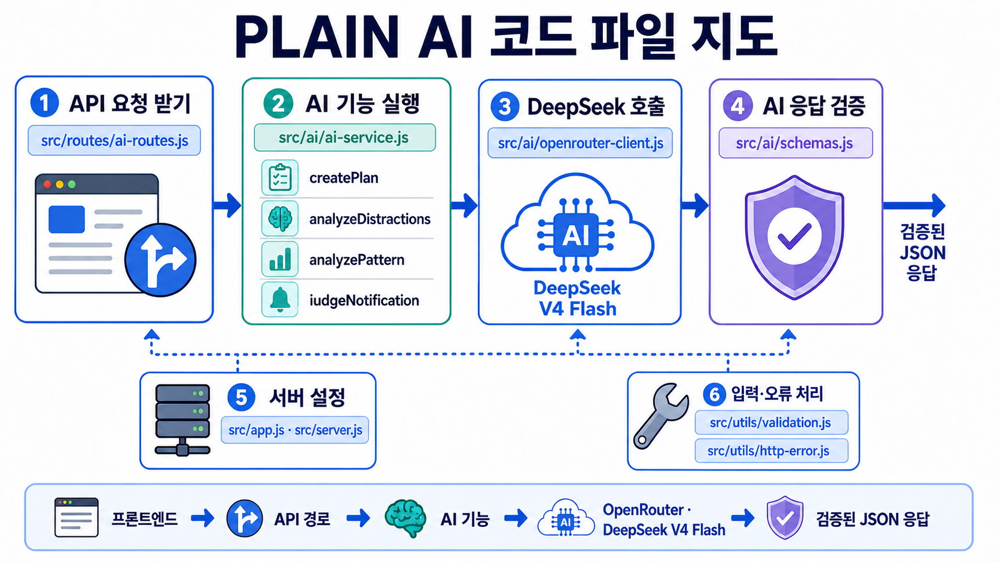

# PLAIN AI 백엔드

PLAIN은 공부나 업무를 방해하는 요소를 줄이고 사용자의 목표에 맞는 계획을 만들어 주는 생활 관리 시스템입니다. 이 저장소의 `ai` 브랜치에는 PLAIN의 AI 기능을 담당하는 JavaScript 백엔드 프로토타입이 들어 있습니다.

처음 보는 사람에게 한 문장으로 설명하면 다음과 같습니다.

> 프론트엔드가 목표와 통계 데이터를 보내면 Express 서버가 입력을 검사하고, OpenRouter를 통해 DeepSeek V4 Flash를 호출한 뒤, 안전하게 검증한 JSON 결과를 돌려주는 시스템입니다.

기본 LLM은 OpenRouter의 DeepSeek V4 Flash(`deepseek/deepseek-v4-flash`)입니다.

## 전체 동작 흐름


1. 사용자가 프론트엔드에서 목표 또는 데이터를 입력합니다.
2. 프론트엔드는 JSON 요청을 AI 백엔드로 보냅니다.
3. 백엔드는 자료형, 글자 수, 배열 크기처럼 기본 입력을 검사합니다.
4. 요청 주소에 맞는 AI 기능과 프롬프트를 선택합니다.
5. 백엔드가 OpenRouter API를 통해 DeepSeek V4 Flash를 호출합니다.
6. DeepSeek가 약속된 JSON 형식으로 결과를 생성합니다.
7. 백엔드는 필요한 필드가 있는지 다시 검사합니다.
8. 검증된 결과만 프론트엔드에 전달합니다.

OpenRouter API 키는 브라우저로 보내지 않고 백엔드의 `.env`에만 보관합니다.

## 어떤 기능이 어느 파일에 구현되어 있나요?



네 가지 AI 기능의 핵심 코드는 모두 [`src/ai/ai-service.js`](src/ai/ai-service.js)에 있습니다.

| AI 기능 | 프론트엔드 호출 주소 | 실제 함수 | 구현 파일 | 하는 일 |
|---|---|---|---|---|
| AI 계획 생성 | `POST /api/ai/plans/generate` | `createPlan()` | `src/ai/ai-service.js` | 목표, 현재 수준, 하루 가능 시간을 이용해 주간·일일 계획을 만듭니다. |
| 방해 앱 분석 | `POST /api/ai/distractions/analyze` | `analyzeDistractions()` | `src/ai/ai-service.js` | 앱 사용 집계 데이터를 분석해 `block`, `allow`, `review`를 추천합니다. |
| 패턴 분석 | `POST /api/ai/patterns/analyze` | `analyzePattern()` | `src/ai/ai-service.js` | 최소 14일의 집중 통계를 분석해 패턴과 개선 행동을 제안합니다. |
| 알림 중요도 판단 | `POST /api/ai/notifications/judge` | `judgeNotification()` | `src/ai/ai-service.js` | 앱 종류와 집중 목표를 보고 알림을 허용·차단·검토 중 하나로 분류합니다. |

API 주소와 함수는 [`src/routes/ai-routes.js`](src/routes/ai-routes.js)에서 연결됩니다.

```js
router.post("/plans/generate", ... aiService.createPlan(body));
router.post("/distractions/analyze", ... aiService.analyzeDistractions(body));
router.post("/patterns/analyze", ... aiService.analyzePattern(body));
router.post("/notifications/judge", ... aiService.judgeNotification(body));
```

## 네 가지 AI 기능 상세 설명

### 1. AI 계획 생성

구현 위치: [`src/ai/ai-service.js`](src/ai/ai-service.js)의 `createPlan()`

입력은 목표, 현재 수준, 하루 가능 시간, 시작 날짜, 추가 조건입니다. 함수는 입력을 검사하고 계획 생성 프롬프트를 만든 뒤 DeepSeek에 주간 계획을 요청합니다. 이후 날짜, 일정 제목, 시작·종료 시간이 포함됐는지 검사하고 검증된 계획만 반환합니다.

현재 AI 계획 생성은 구현되어 있지만 데이터베이스 저장과 결과 화면 표시는 프론트엔드·서버 팀이 연결해야 합니다.

### 2. 방해 앱 분석

구현 위치: [`src/ai/ai-service.js`](src/ai/ai-service.js)의 `analyzeDistractions()`

각 앱의 식별자, 카테고리, 집중 중 사용 횟수, 앱 실행 직후 세션 이탈 횟수, 전체 사용 시간을 받습니다. AI는 각 앱에 `block`, `allow`, `review`, 추천 이유와 신뢰도를 반환합니다.

AI가 앱을 직접 차단하지는 않습니다. 최종 차단 여부는 사용자가 결정해야 합니다.

### 3. 패턴 분석

구현 위치: [`src/ai/ai-service.js`](src/ai/ai-service.js)의 `analyzePattern()`

최소 14일, 최대 90일의 날짜·집중 시간·계획 시간·완료율·차단 횟수를 받습니다. DeepSeek는 핵심 인사이트, 발견한 패턴과 근거, 실행 가능한 개선 행동, 다음 계획 조정 여부를 생성합니다.

현재 통계 분석 API는 있지만 앱 사용 기록을 자동 수집하거나 매일 통계를 만드는 배치 작업은 아직 없습니다.

### 4. 알림 중요도 판단

구현 위치: [`src/ai/ai-service.js`](src/ai/ai-service.js)의 `judgeNotification()`

개인정보 보호를 위해 알림 본문은 DeepSeek에 보내지 않습니다. 앱 식별자, 앱 카테고리, 현재 집중 목표만 이용해 `allow`, `block`, `review` 중 하나를 반환합니다.

실제 휴대폰 알림 접근 및 차단 기능은 모바일 앱 또는 확장 프로그램에서 별도로 구현해야 합니다.

## 파일별 역할

| 파일 | 역할 |
|---|---|
| [`src/ai/ai-service.js`](src/ai/ai-service.js) | 네 가지 AI 기능의 입력 검사, 프롬프트 작성, 결과 검증 순서를 담당합니다. |
| [`src/ai/openrouter-client.js`](src/ai/openrouter-client.js) | OpenRouter에 요청하고 DeepSeek 응답을 받습니다. 타임아웃과 일시적 오류 재시도도 처리합니다. |
| [`src/ai/schemas.js`](src/ai/schemas.js) | AI가 반환한 JSON에 필요한 값이 존재하는지 기능별로 검사합니다. |
| [`src/routes/ai-routes.js`](src/routes/ai-routes.js) | API 주소를 `AiService`의 네 가지 함수와 연결합니다. |
| [`src/app.js`](src/app.js) | Express 앱, CORS, JSON 크기 제한, API 등록, 공통 오류 응답을 설정합니다. |
| [`src/server.js`](src/server.js) | Express 앱을 실제 포트에서 실행하는 시작 파일입니다. |
| [`src/config.js`](src/config.js) | 포트, 모델, OpenRouter 키, 허용할 프론트엔드 주소를 환경변수에서 읽습니다. |
| [`src/utils/validation.js`](src/utils/validation.js) | 문자열·숫자·배열·객체 입력의 형식과 크기를 검사합니다. |
| [`src/utils/http-error.js`](src/utils/http-error.js) | HTTP 상태 코드와 오류 메시지를 함께 관리합니다. |
| [`test/ai-service.test.js`](test/ai-service.test.js) | 실제 OpenRouter 비용 없이 가짜 AI 응답으로 핵심 기능을 테스트합니다. |
| [`.env.example`](.env.example) | 필요한 환경변수 예시이며 실제 API 키는 포함하지 않습니다. |
| [`docs/API.md`](docs/API.md) | 각 API로 보낼 JSON 요청 예시입니다. |
| [`docs/FRONTEND_BACKEND_GUIDE.md`](docs/FRONTEND_BACKEND_GUIDE.md) | 프론트엔드의 `fetch` 코드와 화면 연결 방법입니다. |

## 요청 하나가 코드에서 이동하는 순서

프론트엔드가 `/api/ai/plans/generate`를 호출한다고 가정하면 다음 순서로 실행됩니다.

```text
프론트엔드 fetch
  ↓
src/app.js — Express가 JSON 요청을 받음
  ↓
src/routes/ai-routes.js — 주소를 createPlan에 연결
  ↓
src/ai/ai-service.js — 입력 검사와 계획 프롬프트 작성
  ↓
src/ai/openrouter-client.js — OpenRouter로 DeepSeek V4 Flash 호출
  ↓
src/ai/schemas.js — 계획 JSON 형식 검증
  ↓
src/routes/ai-routes.js — { ok: true, data: 계획 } 응답
  ↓
프론트엔드 결과 화면
```

## 성공 및 실패 응답

성공:

```json
{"ok": true, "data": {}}
```

실패:

```json
{"ok": false, "error": {"message": "사용자에게 보여줄 오류 메시지"}}
```

프론트엔드는 HTTP 상태와 `ok`를 확인해 성공 화면과 오류 화면을 나눠 표시하면 됩니다.

## 설치 및 실행

Node.js 20 이상이 필요합니다.

```bash
npm install
copy .env.example .env
npm run dev
```

`.env`에 본인의 OpenRouter API 키를 입력합니다.

```env
OPENROUTER_API_KEY=본인의_키
OPENROUTER_MODEL=deepseek/deepseek-v4-flash
PORT=3000
CORS_ORIGINS=http://127.0.0.1:4173,http://localhost:4173
```

API 키를 HTML, 프론트엔드 JavaScript 또는 GitHub에 올리면 안 됩니다. 서버가 실행되면 `http://localhost:3000/health`에서 상태를 확인합니다.

## API 목록

| 메서드와 주소 | 설명 |
|---|---|
| `GET /health` | AI 서버가 실행 중인지 확인합니다. |
| `POST /api/ai/plans/generate` | 주간·일일 계획을 생성합니다. |
| `POST /api/ai/distractions/analyze` | 방해 앱을 분석합니다. |
| `POST /api/ai/patterns/analyze` | 14일 이상 통계를 분석합니다. |
| `POST /api/ai/notifications/judge` | 알림의 중요도를 판단합니다. |

요청 JSON은 [`docs/API.md`](docs/API.md), 실제 프론트엔드 연결 코드는 [`docs/FRONTEND_BACKEND_GUIDE.md`](docs/FRONTEND_BACKEND_GUIDE.md)를 참고하세요.

## 테스트

```bash
npm test
```

테스트는 가짜 AI 클라이언트를 사용하므로 OpenRouter API 키와 비용이 필요하지 않습니다.

현재 테스트 항목:

- 주간 계획 결과 검증
- 14일 미만 패턴 데이터 거부
- 방해 앱 분석에 이메일 같은 사용자 식별 정보를 포함하지 않는지 확인

## 현재 구현 범위

### 구현됨

- 네 가지 AI API
- OpenRouter 및 DeepSeek V4 Flash 연결 코드
- 기본 입력 검증과 AI JSON 응답 검증
- 요청 타임아웃과 일시적 오류 재시도
- 환경변수 기반 API 키 관리
- 프론트엔드 CORS 허용 목록
- 공통 성공·실패 응답
- 단위 테스트와 사용 문서

### 아직 필요함

- 로그인 토큰과 사용자 권한 확인
- 사용자별 AI 호출 횟수·비용 제한
- 목표와 AI 결과를 저장할 데이터베이스
- 실제 앱 사용 기록과 집중 세션 수집
- 휴대폰 또는 확장 프로그램의 실제 앱·사이트 차단
- OS 알림 접근 및 차단
- 프론트엔드 화면과 API의 실제 연결
- 실제 OpenRouter API 키를 사용하는 통합 테스트

현재 상태는 네 가지 AI 백엔드 기능을 시험할 수 있는 프로토타입이며, 완성된 모바일 앱이나 서비스 전체는 아닙니다.

## 처음 코드를 읽는 권장 순서

1. 이 README로 전체 목적을 이해합니다.
2. [`src/routes/ai-routes.js`](src/routes/ai-routes.js)에서 API 주소 네 개를 확인합니다.
3. [`src/ai/ai-service.js`](src/ai/ai-service.js)에서 각 AI 함수와 프롬프트를 읽습니다.
4. [`src/ai/openrouter-client.js`](src/ai/openrouter-client.js)에서 DeepSeek 호출 방식을 확인합니다.
5. [`src/ai/schemas.js`](src/ai/schemas.js)에서 결과 검증 방식을 확인합니다.
6. [`src/app.js`](src/app.js)과 [`src/server.js`](src/server.js)에서 서버 시작 과정을 확인합니다.
7. [`test/ai-service.test.js`](test/ai-service.test.js)를 읽고 `npm test`를 실행합니다.
8. 프론트엔드 담당자는 [`docs/FRONTEND_BACKEND_GUIDE.md`](docs/FRONTEND_BACKEND_GUIDE.md)를 따라 연결합니다.

