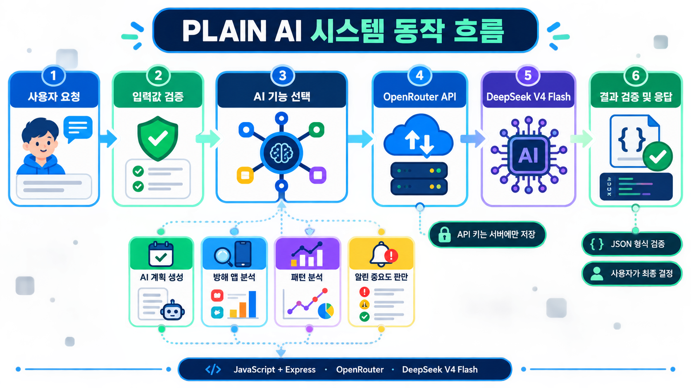

# plainproject AI prototype

Notion 기능 명세서의 AI 기능을 OpenRouter와 JavaScript로 구현한 백엔드 프로토타입입니다. 기본 LLM은 OpenRouter의 최신 DeepSeek V4 Flash(`deepseek/deepseek-v4-flash`)입니다.



## AI 시스템은 이렇게 동작합니다

1. 프론트엔드가 목표나 앱 사용 통계를 AI API로 보냅니다.
2. 서버가 잘못되거나 너무 큰 입력을 먼저 거릅니다.
3. 요청에 맞는 AI 기능과 프롬프트를 선택합니다.
4. 서버에 안전하게 저장된 API 키로 OpenRouter를 호출합니다.
5. DeepSeek V4 Flash가 정해진 JSON 형식으로 결과를 생성합니다.
6. 서버가 결과 형식을 다시 검증한 뒤 프론트엔드에 전달합니다.

## 구현 기능

- 목표·현재 수준·하루 가능 시간을 이용한 주간/일일 계획 생성
- 최근 앱 사용 집계 데이터를 이용한 방해 앱 추천
- 14일 이상 집중 통계에 대한 패턴 분석 및 개선 행동 추천
- 알림 본문을 수집하지 않는 최소 정보 기반 알림 중요도 판정

AI는 차단을 강제로 실행하지 않습니다. `block`, `allow`, `review` 중 하나를 추천하며 최종 선택은 사용자가 합니다.

## 실행

Node.js 20 이상이 필요합니다.

```bash
npm install
copy .env.example .env
npm run dev
```

`.env`의 `OPENROUTER_API_KEY`에 OpenRouter 키를 입력하세요. API 키는 GitHub에 올리지 마세요.

## API

- `POST /api/ai/plans/generate`: AI 주간·일일 계획 생성
- `POST /api/ai/distractions/analyze`: 방해 앱 분석 및 추천
- `POST /api/ai/patterns/analyze`: 14일 이상 통계의 패턴 분석
- `POST /api/ai/notifications/judge`: 최소 정보 기반 알림 판정
- `GET /health`: 서버 상태 확인

자세한 요청 예시는 [`docs/API.md`](docs/API.md)를 참고하세요.

프론트엔드 연결 방법과 실제 `fetch` 예시는 [`docs/FRONTEND_BACKEND_GUIDE.md`](docs/FRONTEND_BACKEND_GUIDE.md)를 참고하세요.

## 구조

```text
src/
  ai/openrouter-client.js  # OpenRouter 통신, 타임아웃, 재시도
  ai/ai-service.js         # 입력 검증과 기능별 프롬프트
  ai/schemas.js            # AI JSON 응답 검증
  routes/ai-routes.js      # API 주소
  utils/                   # 공통 입력 검증과 오류
  app.js                   # Express 앱 설정
  server.js                # 서버 실행
```

## 테스트

```bash
npm test
```

테스트는 실제 OpenRouter를 호출하지 않아 요금이 발생하지 않습니다.
